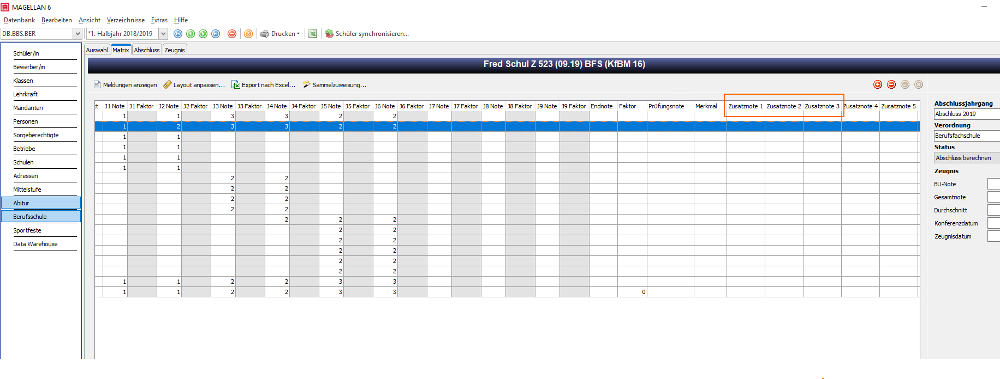

# BER-BFS-Matrix-2016.dws

!!! info "Hinweis"

    Weitere wichtige Informationen finden Sie in der MAGELLAN-Dokumentation im Abschnitt [`Regionales > Berlin`]((https://doc.magellan7.stueber.de/schulverwaltung/regionales/berlin/berlin/))!

## Verordnung

Grundlage bildet die "Ausbildungs- und Prüfungsverordnung für die Berufsfachschule APO-BFS vom 14.07.2009".
Stand: letzte berücksichtigte Änderung: zuletzt geändert durch Artikel 9 der Verordnung vom 28.09.2016 (GVBl. S. 803, 805)

## Berechnungsverordnung und Abschlussjahrgang definieren

### Schlüsselverzeichnis > Verordnung

Bitte legen Sie unter `Schlüsselverzeichnis > Verordnungen` eine neue Zeile an und füllen Sie diese mit den nachstehenden Werten. Beim Synchronisieren der Schüler in das Menü `Berufsschule" weisen Sie den Schülern die Verordnung zu.

|Spalte|Wert|
|--|--|
|Kürzel|beliebig|
|Bezeichnung|beliebig|
|Kategorie|Berufsschule|
|Typ|leer|
|Ab Jahrgang|leer|
|Skript|```...\Ihre Region\Ihr_Skript.dws``` (Pfad zur Skriptdatei auf Ihrem Server)|
|Notenart 11|leer|
|Notenart 12|leer|
|Notenart 13|leer|
|Notenart BBS|leer|
|Gültig von |leer|
|Gültig bis|leer|

### Schlüsselverzeichnis > Abschlussjahrgänge

Bitte legen Sie unter `Schlüsselverzeichnis > Abschlussjahrgänge` Ihren Abschlussjahrgang an.

|Spalte|Wert|
|--|--|
|Kürzel|beliebig (z.B. *2020*)|
|Bezeichnung|beliebig (z.B. *Abschluss 2020*)|
|von|leer|
|bis|leer|
|Kategorie| Berufsschule (Halbjahresnoten)

## Unterscheidung der Fächer durch *Unterrichtsart* und *Fachstatus*

### Berufsübergreifende/Berufsbezogene Unterricht

Berufsübergreifende/Berufsbezogene Fächer werden bei der Zuordnung der Fächer zum Schüler durch die Unterrichtsart gekennzeichnet, dabei gilt folgendes:

* Berufsübergreifende Fächer weisen Sie im Menü `Schüler > Zeugnis > Fächer` im Feld "Unterrichtsart" den Eintrag "BÜ" zu.
* Berufsbezogene Fächer weisen Sie im Menü `Schüler > Zeugnis > Fächer` im Feld "Unterrichtsart" den Eintrag "BU" zu.

Grundlage bildet das `Schlüsselverzeichnis > Unterrichtsarten`. Hier müssen folgende Werte angelegt sein: 

|Kürzel | Schlüssel | Bezeichnung
|--|--|--
|BÜ |BÜ | Berufsübergreifender Unterricht
|BU |BU | Berufsbezogener Unterricht

### Wahlunterricht (fakultativer Unterricht) / Wahlpflichtunterricht

Fächer des Wahlunterrichtes (fakultativer Unterricht) werden bei der Zuordnung der Fächer zum Schüler im Menü `Schüler > Zeugnis > Fächer` durch den Fachstatus „Wahlb“ gekennzeichnet.

Wahlpflichtunterricht wird im Menü `Schüler > Zeugnis > Fächer` durch den Fachstatus „WahlPF“ gekennzeichnet.

Grundlage bildet das `Schlüsselverzeichnis > Fachstatus`. Hier müssen folgende Werte angelegt sein: 

|Kürzel |Schlüssel | Bezeichnung
|--|--|--
|Wahlb | Wahlb | Wahlbereich (Wahlunterricht)
|WahlPF| WahlPF | Wahlpflicht (Wahlpflichtunterricht)

!!! info "Hinweis"

    Wahlunterricht (fakultativer Unterricht, Fächer mit dem Fachstatus "Wahlb") werden bei der Berechnung des Gesamtnotendurchschnitts in der Berufsschulmatrix nicht berücksichtigt.

### Besonderheit Fach "Religion"

Ob ein dem Schüler zugeordnetes Fach das Fach „Religion“ bzw. „Ethik“ ist, richtet sich nach der Definition des Fachs im `Schlüsselverzeichnis > Fächer`.

|Kürzel |Schlüssel| Bezeichnung |Kategorie
|--|--|--|--
|Rel|beliebig| Religion/Ethik|Religion/Ethik
|Eth|beliebig| Religion/Ethik|Religion/Ethik

Kürzel (im abgebildeten Fall „Rel“ für Religion bzw. „Eth“ für Ethik) und Schlüssel können dabei beliebig gewählt werden, entscheidend ist die Zuordnung des Fachs zur Kategorie „Religion/Ethik“ im `Schlüsselverzeichnis > Fächer`.

Besitzt ein Fach im `Schlüsselverzeichnis > Fächer` im Feld "Kategorie" den Eintrag „Religion/Ethik“, wird es automatisch als Wahlunterricht (fakultativer Unterricht) betrachtet.

## Beurteilung der Leistungen in den Prüfungsfächern

### Prüfungsfächer

Ihren Prüfungsfächern müssen Sie im Menü `Berufsschule > Berufschulmatrix` mit dem entsprechenden Fachstatus versehen. Grundlage 
bildet das `Schlüsselverzeichnisse > Fachstatus`. 

Schriftliche Prüfungsfächer können mit Ausnahme des Faches Sport/Gesundheitsförderung alle Lerneinheiten (Unterrichtsfächer, Lernfelder, Projekte) sein, die in der letzten Jahrgangsstufe unterrichtet wurden. Die schriftlichen Prüfungen werden in Fächern des berufsbezogenen Lernbereichs (Unterrichtsart "BU") durchgeführt. Darüber hinaus ist die schriftliche Prüfung in einem Fach des berufsübergreifenden Lernbereichs (Unterrichtsart "BÜ") zulässig. Insgesamt müssen mindestens
drei und dürfen höchstens fünf Fächer schriftlich geprüft werden.
Prüfen Sie, dass in Ihrem Verzeichnis alle erwarteten Werte vorhanden sind oder legen Sie ggfs. an.

|Kürzel |Schlüssel | Bezeichnung|
|--|--|--|
|1PF|1PF|1. Prüfungsfach|
|2PF|2PF|2. Prüfungsfach|
|3PF|3PF|3. Prüfungsfach|
|4PF|4PF|4. Prüfungsfach|
|5PF|5PF|5. Prüfungsfach|

### Noten der Prüfungsfächer

Die Noten der Prüfungsfächer erfassen Sie im Menü `Berufsschule > Berufschulmatrix` in folgenden Spalten:

Spalte | Note für ...
--|--
Zusatznote 1 | schriftliche Prüfung
Zusatznote 2 | mündliche Prüfung
Zusatznote 3 | praktische Prüfung



!!! info "Hinweis"

    Im Menü `Berufsschule > Matrix` können Sie über die Schaltfäche `Layout anpassen` die Spaltenüberschriften anpassen. Sie können auch für jede Spalte bestimmen, ob diese sichtbar ist oder nicht. 

## Wiederholer

Ob ein Schüler im jeweils letzten Zeitraum seiner Laufbahn die Klasse wiederholt, richtet sich nach dem Eintrag unter `Schüler > Laufbahn > Allgemein` im Feld „Wiederholer“. Ist dieses markiert, wiederholt der Schüler die Klasse.

Für das Skript bedeutet dies, dass er kein Zeugnis zugewiesen bekommt.

## Ausreichende Fremdsprachenkenntnisse

Ob ein Schüler über den mittleren Schulabschluss ausreichende Fremdsprachenkenntnisse besitzt, richtet sich nach dem Eintrag unter Ansicht `Schüler > Laufbahn > Allgemein` im Feld „Empfehlung“. Da dies ein Schlüsselfeld ist, müssen Sie unter `Schlüsselverzeichnisse > Empfehlungen` folgenden Eintrag definieren:

|Kürzel |Schlüssel |Bedeutung|
|--|--|--|
|J|beliebig|Ausreichende Fremdsprachenkenntnisse|

Bei keinem Eintrag im Feld „Empfehlung“ hat der Schüler nicht ausreichende Fremdsprachenkenntnisse.

## Zeugnisformulare für Abschluss-, Mittleren Schulabschluss und Abgangszeugnis

Da das Skript automatisch die jeweiligen Zeugnisformulare den Schülern zuordnet, müssen die Zeugnisformulare zuvor unter `Schlüsselverzeichnisse > Zeugnisformulare` definiert werden.

|Bezeichnung| Typ| Datei|
|--|--|--|
|BER-BFS-AS|beliebig|beliebig (Bsp. *BER-Schul Z 522 (09.19).rpt*)
|BER-BFS-MSA|beliebig|beliebig (Bsp. *BER-Schul Z 521 (09.19).rpt*)
|BER-BFS-AZ|beliebig|beliebig (Bsp. *BER-Schul Z 526 (09.19).rpt*)

!!! warning "Wichtig"

    Die Bezeichnungen BER-BFS-AS für das Abschlusszeugnis, BER-BFS-MSA für das Zusatzzeugnis Mittlerer Schulabschluss und BER-BFS-AZ für das Abgangszeugnis sind fest vorgegeben.


### Hinweise zu Zeugnisformularen

#### Schulbezeichnung

Die Schulbezeichnung gemäß Verordnung (z.B. Berufsfachschule für Mode und Design, Kaufmännische Berufsfachschule, etc.) tragen Sie im Menü `Mandanten > Merkmale` im Feld "Merkmal A6" ein. Grundlage bildet das `Schlüsselverzeichnis > Merkmale (Mandaten)`. Hier ist in der Spalte „Bereich“ der Wert  „Merkmal A6“ zuzuweisen.

Folgendes Beispiel:

Kürzel | Schlüssel | Bezeichnung | Bereich
--|--|--|--
beliebig (BFS Kfm) | leer | Kaufmännische Berufsfachschule | Merkmal A6
beliebig (BFS Textil) | leer | Berufsfachschule für Textiltechnik und Bekleidung | Merkmal A6

#### Kammerprüfung 

Die zuständige Kammer der Kammerprüfung tragen Sie im Menü `Klassen > Merkmale > Merkmal A6` ein. Grundlage bildet das `Schlüsselverzeichnis > Merkmale (Klassen)`. Hier ist in der Spalte „Bereich“ der Wert  „Merkmal A6“ zuzuweisen.

Folgendes Beispiel:

Kürzel | Schlüssel | Bezeichnung | Bereich
--|--|--|--
beliebig (IHK) | leer | Industrie- und Handelskammer | Merkmal A6
beliebig (HK) | leer | Handwerkskammer | Merkmal A6

Das "Prüfdatum" vor der Kammer tragen Sie im entsprechenden Zeitraum im Menü `Schüler > Merkmale` im Feld "Merkmal D4" ein.
Die Merkmale D1-D4 können per Sammelzuweisung den Schüler zugewiesen werden. (Sammelzuweisung Stammdaten)